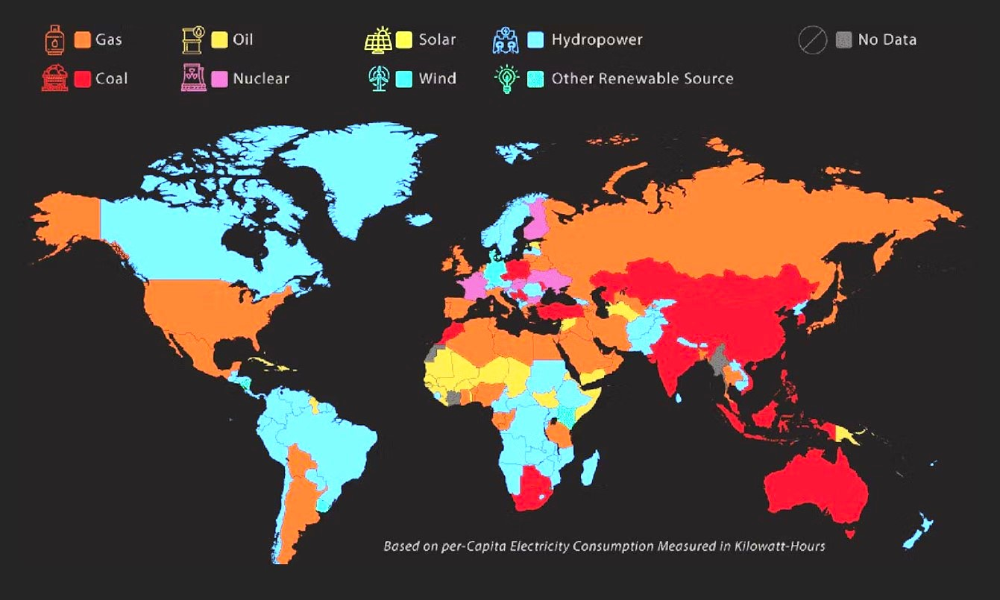
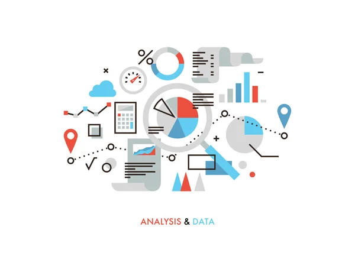
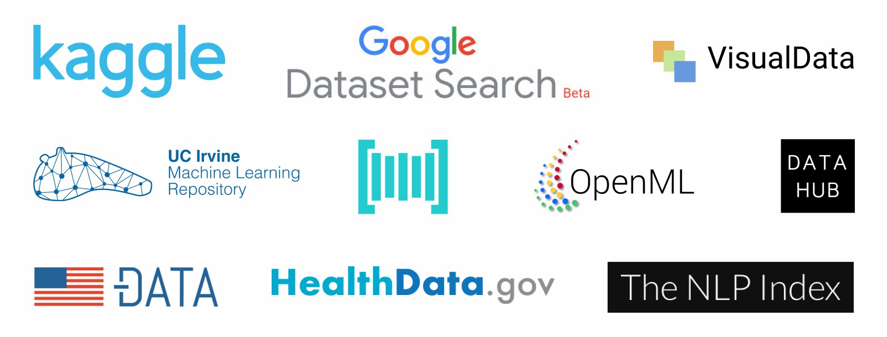
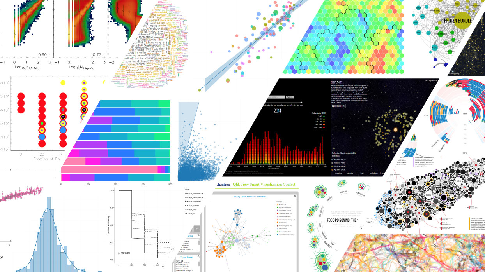

# World Energy Consumption Analysis


## Overview
This project analyzes global energy consumption trends using various energy sources, including gas, coal, oil, biofuel, electricity, wind, solar, hydro, and nuclear. The project is aimed at identifying patterns in energy consumption and highlighting the shift from fossil fuels to renewable energy sources. The dataset includes global energy consumption statistics across several years and regions.

## Project Objectives
1. Analyze global energy consumption by source.
2. Visualize the data through interactive and informative plots.
3. Provide insights into energy consumption trends using geographic and statistical data.

## Usage Instructions
### Prerequisites


- Python 3.x
- Required libraries: `pandas`, `matplotlib`, `seaborn`, `numpy`, `pymongo`, `folium`, and `Flask` (optional for web app).
- MongoDB should be running locally or via a cloud instance (e.g., MongoDB Atlas).

### Instructions
**Some part of the Code**:

    ```
    from pymongo import MongoClient import pandas as pd

    client = MongoClient('mongodb://localhost:27017/')
    db = client['energy_data']
    collection = db['consumption_data']
    
    file_path = ~
    
    df = pd.read_csv(file_path)

    df_cleaned = df.dropna().drop_duplicates()
    
    data_dict = df_cleaned.to_dict('records')
    
    collection.insert_many(data_dict)
    print("Data successfully imported into MongoDB!")

    ```

## Data Sources

- The dataset was obtained from [Kaggle's World Energy Consumption](https://www.kaggle.com/).
- Refer to the `data/` folder for the cleaned CSV data used for the analysis.

## Ethical Considerations
In our analysis, we ensured that:
- No personal or sensitive data was used in this project.
- The analysis promotes sustainable and ethical energy solutions by highlighting the importance of renewable sources.

## Visualizations


The following visualizations were created as part of the project:
1. Global Energy Consumption Trends (Bar/Line Charts)
2. Geographical Representation of Energy Consumption (using `folium` for map-based visualization)
3. Source-by-Source Energy Breakdown

## Additional Libraries


We used `folium` to provide geographic visualizations of energy consumption, which was not covered during the course.

## References
- **Data**: World Energy Consumption dataset from Kaggle.
- **Libraries**: The `pandas`, `folium`, and `matplotlib` libraries were essential in this project.
- Some code snippets were adapted from official documentation of libraries and StackOverflow posts.

## Next Steps:
1. **ETL Workflow**: 
- Document the ETL (Extract, Transform, Load) process used in the project. This includes explaining how data is extracted from the source (e.g., CSV files), how it's transformed (cleaned, filtered, aggregated), and how it's loaded into the database (MongoDB).
2. **Interactive Visualizations**:
- The project makes use of Folium for creating interactive maps to visualize energy consumption data by country. These maps allow users to zoom, pan, and explore specific data points in an intuitive way.
- Additionally, other Python libraries such as Matplotlib and Plotly have been used to generate interactive line plots, bar charts, and bubble charts, allowing for deeper exploration of energy consumption trends over time.
- Moving forward, we plan to expand these visualizations by adding more advanced features like popups and time sliders to allow users to filter data by year or energy type directly on the map.

## Conclusion
- This project successfully demonstrates a comprehensive approach to analyzing global energy consumption trends. By utilizing a variety of data visualization tools, we provided clear insights into the patterns of energy use across different regions and energy sources. The interactive maps created with folium, along with detailed statistical charts, offer users an engaging way to explore the data and derive meaningful insights.

- The shift from fossil fuels to renewable energy sources is clearly reflected in the visualizations, highlighting the growing role of sustainable energy in modern economies. The project's structure, including the ETL process, allows for scalability and future enhancements, such as integrating more data or refining visualizations for deeper analysis.

- This project serves as a strong foundation for future work, providing valuable insights that can help drive discussions around energy policy and sustainable development. The collaborative efforts of the team have been key to achieving these outcomes, ensuring that the project not only delivers informative content but also a dynamic and user-friendly experience for exploring global energy consumption data.

### Teamwork


This project is a collaborative effort between *Anupreet Kaur*, *Ashish Singh*, *Sirisha Tulasiram* and *Zara Pazouki*.  
